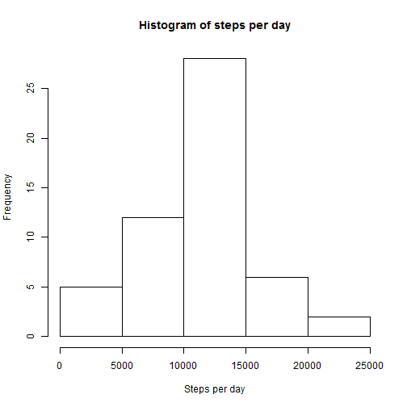
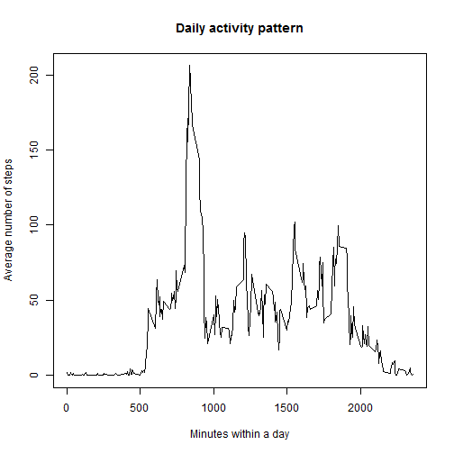
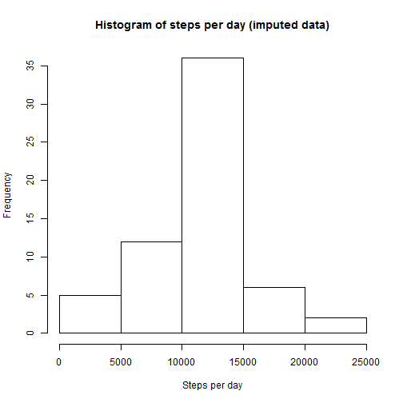
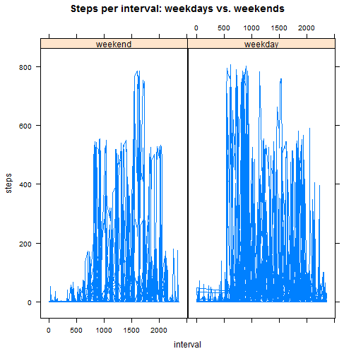

# Peer Assessment 1

## Loading and preprocessing the data

Load data

```r
data <- read.csv("activity.csv", header=T, colClasses=c("integer", "Date", "integer"))
```

Subset data to ignore missing values in the dataset

```r
completedata <- na.omit(data)
```

## What is mean total number of steps taken per day?

Calculate total number of steps per day

```r
stepsPerDay <- aggregate(steps ~ date, completedata, sum)
```

Plot steps per day on histogram

```r
hist(stepsPerDay$steps, main="Histogram of steps per day", xlab="Steps per day")
```

 

Calculate and report the mean and median of the total number of steps taken per day

```r
mean(stepsPerDay$steps)
```

```
## [1] 10766.19
```

```r
median(stepsPerDay$steps)
```

```
## [1] 10765
```

## What is the average daily activity pattern?

Average number of steps taken per 5-minute interval, averaged across all days

```r
avStepsPerInterval <- aggregate(steps ~ interval, completedata, mean)
plot(avStepsPerInterval$interval, avStepsPerInterval$steps,
     type="l",
     main="Daily activity pattern", xlab="Minutes within a day", ylab="Average number of steps")
```

 

Which 5-minute interval, on average across all the days in the dataset, contains the maximum number of steps?

```r
avStepsPerInterval[which.max(avStepsPerInterval$steps),1]
```

```
## [1] 835
```

## Imputing missing values

Calculate and report the total number of missing values in the dataset

```r
colSums(is.na(data))
```

```
##    steps     date interval 
##     2304        0        0
```

Filling in all of the missing "step" values in the dataset with the average daily steps for each interval

```r
na.data <- data[is.na(data$steps),2:3]
data2 <- merge(na.data, avStepsPerInterval, by = "interval")
data2 <- data2[ ,c("steps","date","interval")]
imputed_data <- rbind(completedata,data2)
```

Make a histogram of the total number of steps taken each day

```r
imputed_stepsPerDay <- aggregate(steps ~ date, imputed_data, sum)
hist(imputed_stepsPerDay$steps, main="Histogram of steps per day (imputed data)", xlab="Steps per day")
```

 

Mean:

```r
mean(imputed_stepsPerDay$steps)
```

```
## [1] 10766.19
```

Median:

```r
median(imputed_stepsPerDay$steps)
```

```
## [1] 10766.19
```

Imputing missing values based on on the estimates of the total daily number of steps does not change the mean and median total number of steps taken per day.

## Are there differences in activity patterns between weekdays and weekends?

Create a new factor variable in the dataset with two levels – “weekday” and “weekend” indicating whether a given date is a weekday or weekend day

```r
wdays <- c('Monday', 'Tuesday', 'Wednesday', 'Thursday', 'Friday')
Sys.setlocale("LC_TIME", "English")
```

```
## [1] "English_United States.1252"
```

```r
imputed_data$wDay <- factor((weekdays(imputed_data$date) %in% wdays), levels=c(FALSE, TRUE), labels=c('weekend', 'weekday'))
```

Panel plot - average number of steps taken, averaged across all weekday days or weekend days

```r
library(lattice)
xyplot(steps ~ interval | wDay, data=imputed_data, type="l", main="Steps per interval: weekdays vs. weekends")
```

 
